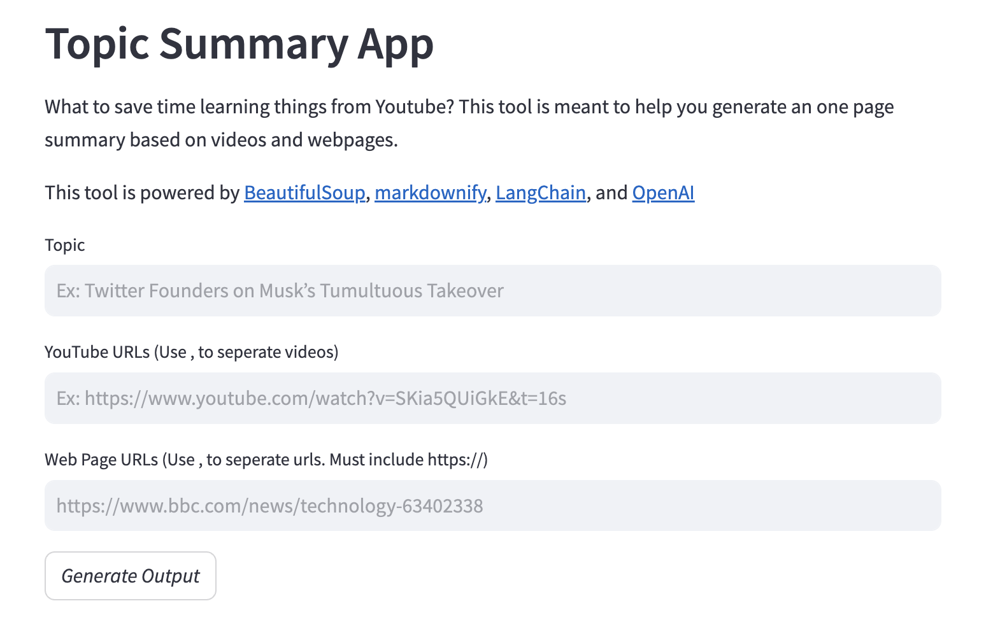

# Topic_summarization
This app summarizes topics based on Youtube videos and webpages through GPT-4. <br />  


# Feature 
- Get a one-page topic summary from your input Youtube videos and webpages.

# Example
We are interested in the topic: "Twitter Founders on Musk’s Tumultuous Takeover." <br />  
We found an interview video of Twitter founders: https://www.youtube.com/watch?v=SKia5QUiGkE&t=16s <br />  
And a webpage that writes about it: https://www.bbc.com/news/technology-63402338 <br />  

The app combines that information, feeds it to GPT-4, and comes up with a summary. Save your time from listening to all those videos.

# Running locally 
1. Clone the repository <br />  
``` git clone https://github.com/Lastget/topic_summarization.git ```
2. Install dependencies
- python
- streamlit 
- langchain 
- requests 
- bs4 
- markdownify 
- openai 
- tiktoken 
- regex 
- pytube 
- youtube-transcript-api <br />  
``` poetry install ```

3. Run the Streamlit server <br />  
``` streamlit run main.py ```   
